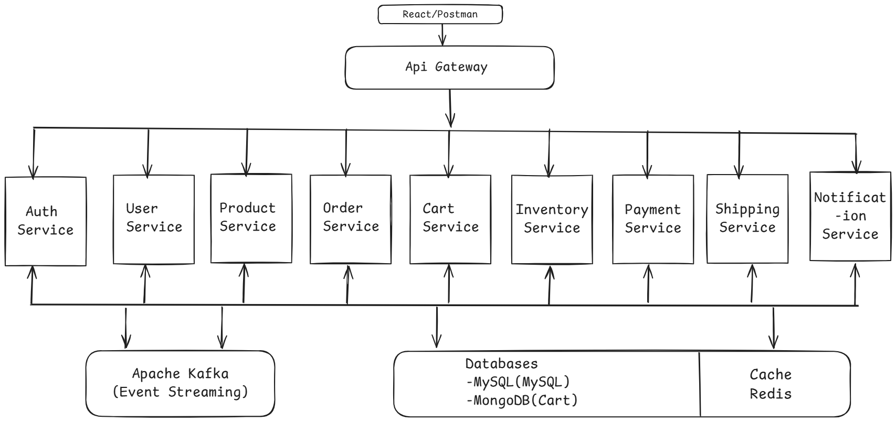
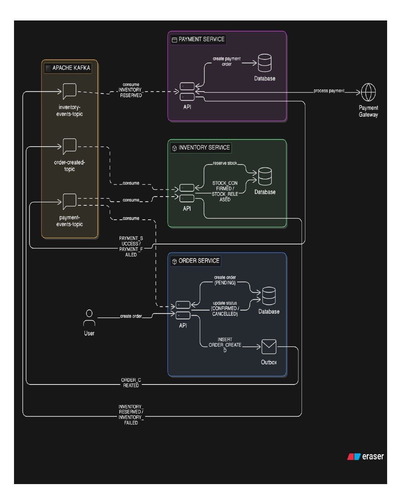

## ShopSphere – Microservices E-Commerce Platform

ShopSphere is a modern, scalable microservices-based e-commerce platform built using Spring Boot and Spring Cloud. It demonstrates real-world enterprise architecture by handling complete online shopping workflows including authentication, product management, ordering, payments, and notifications.

 ## Architecture Overview

## ShopSphere follows an event-driven microservices architecture with:

API Gateway for routing & security
Service Discovery using Eureka
Centralized Configuration Server
Independent microservices for each domain
Asynchronous communication using Kafka
Distributed transaction handling using Saga Pattern

## Core Microservices
<h2 align="center">⚙️ Microservices</h2>

<table align="center">
  <tr>
    <th>Service Name</th>
    <th>Responsibility</th>
    <th>Tech Stack</th>
  </tr>

  <tr>
    <td>Auth Service</td>
    <td>User authentication & JWT security</td>
    <td>Spring Boot, Spring Security, JWT, MySQL, Kafka</td>
  </tr>

  <tr>
    <td>User Service</td>
    <td>User profile & management</td>
    <td>Spring Boot, MySQL, Kafka</td>
  </tr>

  <tr>
    <td>Product Service</td>
    <td>Product catalog management</td>
    <td>Spring Boot, MySQL, Redis, Kafka</td>
  </tr>

  <tr>
    <td>Cart Service</td>
    <td>Shopping cart operations</td>
    <td>Spring Boot, MongoDB, Redis, Kafka</td>
  </tr>

  <tr>
    <td>Order Service</td>
    <td>Order processing</td>
    <td>Spring Boot, MySQL, Kafka, Saga Pattern</td>
  </tr>

  <tr>
    <td>Payment Service</td>
    <td>Payment handling</td>
    <td>Spring Boot, MySQL, Kafka,
Razorpay Payment Gateway</td>
  </tr>

  <tr>
    <td>Inventory Service</td>
    <td>Stock management</td>
    <td>Spring Boot, MySQL, Kafka</td>
  </tr>

  <tr>
    <td>Shipping Service</td>
    <td>Shipment processing</td>
    <td>Spring Boot, MySQL, Kafka</td>
  </tr>

  <tr>
    <td>Notification Service</td>
    <td>Email/SMS notifications</td>
    <td>Spring Boot, Kafka, Mail API</td>
  </tr>

</table>

## Key Features
Scalable and loosely coupled architecture
Event-driven communication using Kafka
Fault tolerance with Circuit Breaker
API Gateway with centralized routing
Distributed tracing (Zipkin)
Centralized logging & monitoring
Secure authentication using JWT
## Tech Stack
Backend: Java, Spring Boot, Spring Cloud
Database: MySQL / MongoDB
Messaging: Apache Kafka
DevOps: Docker
Tools: Eureka, Zipkin, Config Server, API Gateway
## Purpose

## This project is built to:
Demonstrate real-world microservices architecture
Implement scalable and distributed systems
Showcase backend engineering skills for job readiness
 Future Enhancements
Kubernetes deployment
CI/CD pipeline integration
Advanced monitoring with Prometheus & Grafana

## How to Run

### 1. Clone Repository
git clone https://github.com/Shubham-Mungase/shopsphere.git

### 2. Start Services in Order

1. Config Server
2. Eureka Server
3. API Gateway
4. All Microservices

### 3. Start Kafka & Zookeeper

### 4. Access API Gateway
http://localhost:8080

## Order Flow

1. User places an order
2. Order Service creates order
3. Event sent to Kafka
4. Inventory Service updates stock
5. Payment Service processes payment
6. Shipping Service handles delivery
7. Notification Service sends confirmation

##  Challenges & Solutions

- Handling distributed transactions → Solved using Saga Pattern
- Service communication → Implemented Kafka event-driven architecture
- Fault tolerance → Used Circuit Breaker
- Service discovery → Implemented Eureka Server

## Architecture Diagram

  

## 
## 🔄 Saga Flow (Order Processing)

  

### 📌 Flow Explanation

1. User places an order via Order Service  
2. Order Service creates order and publishes event to Kafka  
3. Payment Service processes payment  
4. On success → Inventory Service updates stock  
5. Then → Shipping Service handles delivery  
6. Finally → Notification Service sends confirmation  

### ❌ Failure Handling (Saga Rollback)

- If payment fails → Order is cancelled  
- If inventory fails → Payment is refunded  
- If shipping fails → Inventory is restored  

👉 This ensures data consistency using Saga Pattern.
##  Author

Shubham Mungase  
Java Backend Developer  
LinkedIn: https://www.linkedin.com/in/shubham-mungase-b635222a5/
